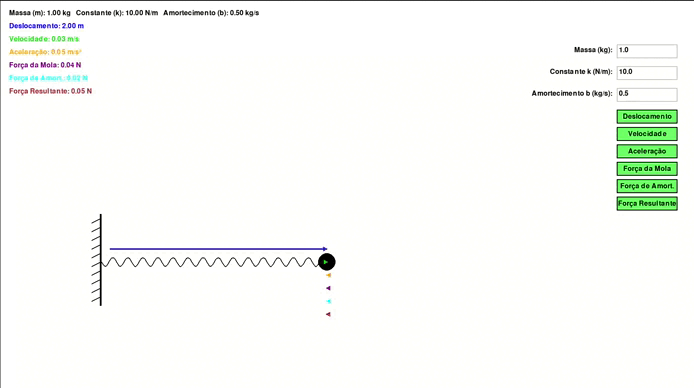

## Simulação de Sistema Massa-Mola Amortecido

### Objetivo e Tipo de Projeto

Este projeto consiste em uma **simulação interativa** projetada para **visualizar e compreender** o comportamento dinâmico de um sistema massa-mola com amortecimento. O principal objetivo é demonstrar o movimento de uma massa conectada a uma mola, enquanto o usuário pode interagir com a simulação ajustando parâmetros como:

- **Massa** ($m$),
- **Constante da mola** ($k$),
- **Coeficiente de amortecimento** ($b$).

Com essas interações, o usuário observa como as variáveis físicas influenciam diretamente o comportamento do sistema, incluindo o padrão de oscilações e a taxa de amortecimento. A simulação é ideal para estudantes e profissionais que buscam explorar conceitos fundamentais de física e engenharia.



Este projeto implementa a solução para a simulação de um sistema massa-mola-amortecedor utilizando o **Método de Verlet de Velocidade**. A abordagem consiste em calcular iterativamente as grandezas dinâmicas do sistema (força, aceleração, velocidade e posição) ao longo do tempo. O método baseia-se na discretização temporal, calculando as atualizações para cada intervalo de tempo ($\Delta t$).

A cada passo de tempo:
   - Calculamos a força da mola e a força de amortecimento.
   - Somamos as forças para obter a força resultante.
   - Atualizamos a posição considerando a velocidade e aceleração atuais.
   - Recalculamos a aceleração com base na nova posição.
   - Atualizamos a velocidade utilizando a média das acelerações (atual e nova).

O uso do **Método de Verlet de Velocidade** proporciona maior precisão e estabilidade em relação ao método de Euler, sendo especialmente adequado para sistemas oscilatórios como o massa-mola-amortecedor.

A cada passo de tempo:
   - Calculamos a força da mola e a força de amortecimento.
   - Somamos as forças para obter a força resultante.
   - Atualizamos a aceleração, velocidade e posição usando o método de Euler explícito.

---

### Conceitos Físicos e Modelo Matemático

#### Conceito Principal

O sistema representado neste projeto segue os princípios do **movimento oscilatório amortecido**. A massa é inicialmente deslocada e sofre a ação de duas forças principais:

1. **Força elástica** da mola ($-k \cdot x$), que busca restaurar a massa à posição de equilíbrio,
2. **Força de amortecimento** ($-b \cdot \dot{x}$), que reduz a energia do sistema ao longo do tempo.

#### Modelo Matemático

A dinâmica do sistema é descrita pela **segunda lei de Newton** aplicada a sistemas dinâmicos:

$$
m \cdot \ddot{x} = -k \cdot x - b \cdot \dot{x}
$$

Simplificando:

$$
\ddot{x} + \frac{b}{m} \dot{x} + \frac{k}{m} x = 0
$$

Onde:
- $m$: massa (kg),
- $k$: constante da mola (N/m),
- $b$: coeficiente de amortecimento (kg/s),
- $x(t)$: deslocamento da massa em função do tempo.

---

### Solução Matemática

#### Reformulação

Definimos os seguintes parâmetros:
- **Coeficiente de amortecimento relativo**: $\gamma = \frac{b}{2m}$,
- **Frequência natural**: $\omega_0 = \sqrt{\frac{k}{m}}$.

A equação diferencial torna-se:

$$
\ddot{x} + 2\gamma \dot{x} + \omega_0^2 x = 0
$$

#### Tipos de Amortecimento

O comportamento do sistema depende do discriminante $\gamma^2 - \omega_0^2$:

1. **Subamortecido** ($\gamma^2 < \omega_0^2$): Oscilações amortecidas.
2. **Amortecimento crítico** ($\gamma^2 = \omega_0^2$): Retorno ao equilíbrio sem oscilações, em tempo minímo.
3. **Superamortecido** ($\gamma^2 > \omega_0^2$): Retorno lento ao equilíbrio, sem oscilações.

#### Solução Geral (Caso Subamortecido)

No caso de amortecimento subcrítico, as raízes da equação característica são complexas:

$$
r = -\gamma \pm i \omega_d
$$

Onde:
- $\omega_d = \sqrt{\omega_0^2 - \gamma^2}$: frequência angular do sistema amortecido.

A solução geral é:

$$
x(t) = e^{-\gamma t} \left( C_1 \cos(\omega_d t) + C_2 \sin(\omega_d t) \right)
$$

Ou, de forma simplificada:

$$
x(t) = A e^{-\gamma t} \cos(\omega_d t + \phi)
$$

- $A$: amplitude inicial,
- $\phi$: fase inicial,
- $\gamma = \frac{b}{2m}$: taxa de amortecimento,
- $\omega_d$: frequência angular do movimento amortecido.

---

### Simulação Interativa

#### Parâmetros Ajustáveis

Na simulação, o usuário pode ajustar os seguintes parâmetros:
- **Massa ($m$)**: Controla a inércia do sistema.
- **Constante da mola ($k$)**: Determina a rigidez da mola.
- **Coeficiente de amortecimento ($b$)**: Influencia a dissipação de energia.

A simulação inicia com valores padrão:
- Massa ($m$) = 1.0 kg,
- Constante da mola ($k$) = 10.0 N/m,
- Coeficiente de amortecimento ($b$) = 0.5 kg/s.

#### Recursos Interativos

- **Visualização em tempo real**: O comportamento da mola e da massa é exibido graficamente, incluindo oscilações e a taxa de amortecimento.
- **Controles dinâmicos**: O usuário pode modificar os valores dos parâmetros durante a execução.
- **Análise qualitativa**: Identifique como o amortecimento e a rigidez influenciam o tempo de retorno e a frequência do sistema.

---

### Implementação Técnica

#### Linguagens e Pacotes

A simulação é implementada em **Python**, com a biblioteca **PyGame** para criar a interface gráfica. Outros módulos necessários incluem:

```python
import pygame
import sys
import math
import matplotlib.pyplot as plt
import matplotlib
```

#### Ambiente de Desenvolvimento

O ambiente recomendado para execução é o **Conda**, garantindo compatibilidade de dependências. No entanto, é possível usar apenas o `pip` com Python.

---

### Passos para Execução

> ⚠️ Atenção: caso for rodar no MacOS, comente a linha 8 e descomente a linha 9

#### 1. Usando Conda (Recomendado)

1. **Instalar o Conda**: Siga o guia oficial de instalação do Conda [aqui](https://docs.conda.io/projects/conda/en/latest/user-guide/install/index.html).
2. **Criar o Ambiente Conda**:
   ```bash
   conda env create -f environment.yml
   ```
3. **Ativar o Ambiente**:
   ```bash
   conda activate spring
   ```
4. **Executar a Simulação**:
   ```bash
   python spring.py
   ```

#### 2. Usando Python e `pip`

1. **Instalar o Python**: Baixe uma versão compatível de Python [aqui](https://www.python.org/downloads/).
2. **Instalar Dependências**:
   ```bash
   pip install -r requirements.txt
   ```
3. **Executar o Script**:
   ```bash
   python spring.py
   ```

---

### Configurações Iniciais e Personalização

Os valores padrão podem ser ajustados diretamente no código ou dinamicamente durante a simulação. Isso permite realizar experimentos e observar comportamentos específicos do sistema.

#### Possíveis Experimentos:
1. **Alterar o amortecimento** ($b$): Observe como oscilações são amortecidas.
2. **Modificar a rigidez** ($k$): Explore a relação entre rigidez e frequência.
3. **Variar a massa** ($m$): Veja como a inércia afeta o sistema.

---

### Aplicabilidade

Esta simulação tem diversas aplicações práticas:
- **Ensino de física**: Entender o movimento oscilatório.
- **Engenharia**: Projetar sistemas mecânicos com amortecimento.
- **Análise de sistemas reais**: Modelar fenômenos como suspensões de veículos ou estruturas submetidas a vibrações.

---

### Conclusão

O projeto de simulação interativa de sistemas massa-mola proporciona uma ferramenta poderosa para visualizar e compreender o movimento oscilatório amortecido. Sua interface intuitiva e a possibilidade de ajustar parâmetros em tempo real tornam a experiência didática e envolvente, beneficiando estudantes e profissionais de diversas áreas.

### Referências

[Notas de Aula Professor Esmerindo - IFCS](https://edisciplinas.usp.br/pluginfile.php/8442805/mod_folder/content/0/Notas%20de%20aulas/dinamica-v4.pdf?forcedownload=1)

[Slides Professor Antônio Roque - FFCLRP](https://edisciplinas.usp.br/pluginfile.php/5190811/mod_resource/content/1/aula5.pdf)

[Wikipedia - Oscilador Harmônico](https://pt.wikipedia.org/wiki/Oscilador_harm%C3%B4nico)

[Wikipedia - Método de Varlet](https://pt.wikipedia.org/wiki/M%C3%A9todo_de_Verlet)
